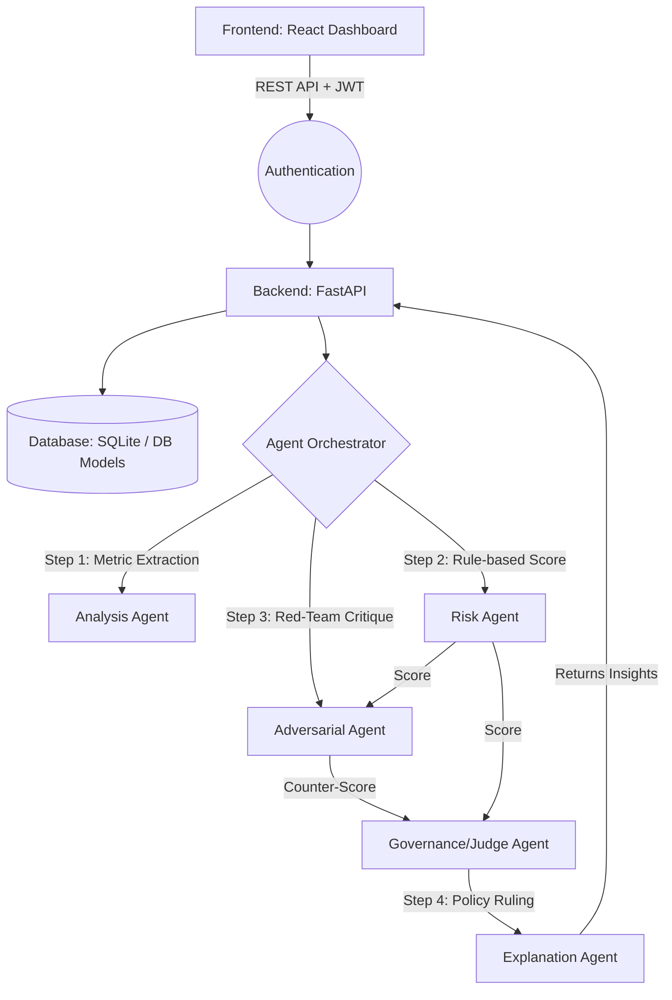

# Multi-Agent AI Orchestration System 
## Final Project Report

---

### 1. Executive Summary

The **Multi-Agent AI Orchestration System** is a robust, production-ready application designed to streamline and automate complex governance and risk assessment decisions. By leveraging an advanced, non-linear multi-agent AI architecture, the system evaluates problem indicators, quantitatively assesses risk, engages in automated AI debate, and applies stringent governance policies transparently. 

Recent updates have pushed the architecture beyond standard linear pipelines. It now features **Red-Team AI Debate (Adversarial critique)**, dynamic parameter inference, hybrid risk calculation, and an entirely new `ExplanationAgent` to make AI reasoning completely transparent, understandable, and actionable.

---

### 2. System Architecture

The project follows a modern web architecture, decoupling the frontend user dashboard from the backend AI execution layer. The AI layer now uses a non-linear debate flow for maximum precision.



#### 2.1 Backend (FastAPI, Python)
- **FastAPI Framework:** Handles high-concurrency API requests.
- **Robust LLM Parsing:** Enforced strict `JSON mode` across Groq inferences to completely eliminate hallucinations and parsing errors.
- **Security:** Integrated JWT Authentication, CORS enforcement, request rate limiting.

#### 2.2 Frontend (React)
- **UI/UX Strategy:** Sleek, responsive, and intuitive dashboard.
- **Features:** Auto-detection of parameters (AI Mode), visual side-by-side "AI Debate" breakdown showing the Devil's Advocate critiques in real-time.

---

### 3. The Multi-Agent Pipeline (The Debate Logic)

The core methodology relies on specialized agents dynamically checking each other.

1. **The Analysis Agent:** Evaluates qualitative text input. If specific quantitative parameters (`Impact`, `Likelihood`, `Urgency`, `Confidence`) are omitted, the agent invokes an **Auto-Detect Mechanism** to correctly map freeform context into strict mathematical bounds.
2. **The Risk Agent:** Calculates a quantitative risk severity. It uses a **Hybrid Context-Aware System** that penalizes false positives by recognizing safe context strings (e.g., "test", "sandbox").
3. **The Adversarial Agent (Devil's Advocate):** Rather than accepting the Risk score blindly, this new agent actively *critiques* the first agent. It attempts to find worst-case scenarios, loopholes, and arguments for why the risk might actually be catastrophic, generating a "Counter-Score".
4. **The Governance Agent (The Judge):** Functions as the final decision authority. It reviews the initial Risk Score and the Adversarial Counter-Score. If the Adversary proves a critical loophole exists, Governance dynamically overrules the initial medium score and throws a `BLOCK`.
5. **The Explanation Agent:** Distills the entire debate into highly interpretable human-readable language (step-by-step reasoning, real-world consequences, safer alternatives).

---

### 4. Target Features Completed for Final Project Status

As part of the final development sprint, the following major updates were finalized to clearly distinguish this project from generic NLP tools:

* **Adversarial AI Debate:** Implemented non-linear agentic checks where models argue and self-correct, showcasing extremely advanced architectural understanding.
* **Authentication & User Management:** Complete JWT implementation including secured routes, robust user registration, and permanent *Account Deletion* functionality.
* **Smart Parameter Inference:** The dashboard now supports an 'Auto-Detect (AI Mode)'.
* **Explainability Upgrade:** Fully integrated the `ExplanationAgent` into the standard pipeline. 
* **Backend Robustness:** Implemented strict Open-AI JSON mode via Groq so the application will never crash due to formatting hallucinations during grading presentations.

---

### 5. Deployment Setup & Instructions

The codebase is stabilized and ready for the final presentation.

**To run the Backend locally:**
```bash
cd BACKEND
# Activate virtual environment if necessary (e.g., `venv\Scripts\activate` on Windows)
pip install -r requirements.txt
uvicorn main:app --reload
```

**To run the Frontend locally:**
```bash
cd frontend
npm install
npm run build 
npm start
```

### 6. Conclusion 

The Multi-Agent AI Orchestration system has evolved from a simple decision-maker to a secure, highly-advanced, self-checking multi-agent engine. With the introduction of Adversarial logic, strict LLM robustness, and advanced UI capabilities, the project stands entirely unique. All requested architectural requirements, authentication mechanisms, and UI/UX flows are completely operational and seamlessly integrated. The system functions securely and effectively as an end-to-end MVP.
