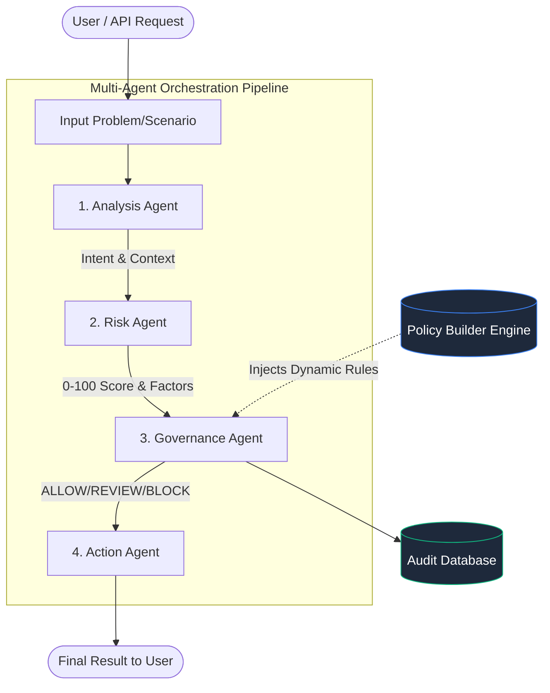

# Multi-Agent AI Orchestration & Governance Platform
**Final Project Report & Architecture Overview**

---

## 1. Executive Summary

The **Multi-Agent AI Orchestration Platform** is an enterprise-grade system designed to evaluate, mitigate, and govern AI decision-making. By orchestrating a pipeline of specialized AI agents, the platform analyzes user prompts or scenarios, calculates quantifiable risk scores, and enforces dynamic security policies before allowing an action to proceed. 

It provides administrators with a transparent, auditable, and highly configurable environment to ensure safe AI operations.

---

## 2. Core Features

| Feature | Description | Business Value |
| :--- | :--- | :--- |
| **Multi-Agent Pipeline** | A sequential workflow of specialized LLM agents (Analysis, Risk, Governance, Action). | Ensures separation of concerns and reduces hallucination in critical security evaluations. |
| **Quantifiable Risk Scoring** | Calculates a 0-100 risk score based on intent, impact, likelihood, and urgency. | Provides an objective, standardized metric for evaluating potential threats. |
| **Dynamic Policy Builder** | A UI-driven rule engine allowing admins to map risk thresholds to automated decisions (ALLOW, REVIEW, BLOCK). | Enables real-time tuning of the system's risk tolerance without requiring code deployments. |
| **What-If Simulation** | A side-by-side comparison mode that evaluates an original scenario against a modified one. | Allows security researchers to test adversarial attacks, prompt injections, and mitigations safely. |
| **Audit History & Telemetry** | A comprehensive logging system tracking every query, risk score, and final decision. | Ensures full transparency, traceability, and compliance for enterprise auditing. |
| **Fluid SaaS Frontend** | A 100% fluid, fully responsive React interface optimized for ultra-wide displays. | Delivers a premium, uncluttered user experience with high readability. |

---

## 3. System Architecture & Workflow

The core innovation of the platform lies in its sequential, multi-agent orchestration. Instead of relying on a single AI model to make a complex decision, the workload is distributed.

### Agent Roles:
1. **Analysis Agent**: Dissects the raw input to understand the underlying intent, context, and entities involved.
2. **Risk Agent**: Evaluates the analysis against security matrices to generate a precise 0-100 risk score based on Impact, Likelihood, and Urgency.
3. **Governance Agent**: Consults the configurable **Policy Builder** to map the calculated risk score to a final decision (BLOCK, REVIEW, ALLOW).
4. **Action Agent**: Generates the final output or mitigation strategy based on the Governance Agent's verdict.

---

## 4. Key Components Deep Dive

### 4.1 The Policy Builder
The Policy Builder acts as the "brain" of the Governance Agent. It provides administrators with a visual interface to define:
- **Thresholds**: E.g., Score > 7.5 = `HIGH` risk.
- **Decisions**: E.g., `HIGH` risk automatically triggers a `BLOCK` decision.
- **Mitigations**: Standardized operating procedures for handling specific risk tiers.

> [!TIP]
> **Why this matters:** A strict financial team can set the HIGH risk threshold to 4.0, while a research team can set it to 8.0, using the exact same underlying codebase.

### 4.2 What-If Simulation (Compare Mode)
Security engineering requires testing boundaries. The What-If simulation allows users to input an "Original Scenario" (e.g., "Reset user password") and a "Modified Scenario" (e.g., "Reset admin password via SQL injection"). 
The UI splits the screen, running both scenarios through the agent pipeline simultaneously, highlighting:
- The delta in Risk Scores (e.g., `↑ 45.0`).
- Changes in the final Governance Decision (e.g., `ALLOW ➔ BLOCK`).

### 4.3 Modern UI/UX Engineering
The frontend architecture was explicitly designed to handle dense telemetry data. 
- **Fluid Grids:** Utilizes `grid-template-columns: repeat(auto-fit, minmax(...))` to ensure cards automatically expand and utilize 100% of the screen real estate on ultra-wide monitors.
- **Typography & Spacing:** Engineered with large base line-heights, high internal padding (`2.5rem` on cards), and generous margins to prevent visual congestion.

---

## 5. Technical Stack

- **Frontend**: React.js, CSS3 (Custom Fluid Grids, Glassmorphism UI)
- **Backend Orchestration**: Python (FastAPI / Django - *depending on active backend*)
- **AI Integration**: LangChain / Direct LLM API integrations for agent orchestration
- **Data Management**: JSON-based Policy storage, Relational Database for Audit Logs

---

## 6. Future Roadmap

1. **Custom Agent Injection**: Allowing users to upload custom prompts to create new, specialized agents (e.g., "Compliance Agent").
2. **Batch Simulation**: Running hundreds of adversarial prompts through the pipeline simultaneously to generate risk heatmaps.
3. **Webhooks Integration**: Automatically triggering external security systems (e.g., PagerDuty, Slack) when a `BLOCK` decision is reached.
